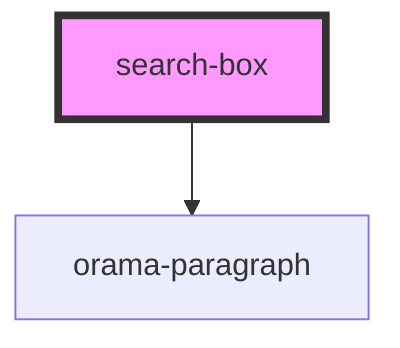

# search-box

<!-- Auto Generated Below -->

## Properties

| Property      | Attribute | Description | Type                                                                                  | Default     |
| ------------- | --------- | ----------- | ------------------------------------------------------------------------------------- | ----------- |
| `color`       | `color`   |             | `"dark" \| "light" \| "system"`                                                       | `undefined` |
| `themeConfig` | --        |             | `{ colors: { light: { primaryColor: string; }; dark: { primaryColor: string; }; }; }` | `undefined` |

## Dependencies

### Depends on

- [orama-paragraph](../internal/Typography)

### Graph

----------------------------------------------

*Built with [StencilJS](https://stenciljs.com/)*
