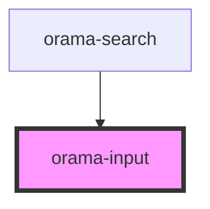

# orama-input

<!-- Auto Generated Below -->

## Properties

| Property                | Attribute                  | Description | Type                             | Default     |
| ----------------------- | -------------------------- | ----------- | -------------------------------- | ----------- |
| `label`                 | `label`                    |             | `string`                         | `undefined` |
| `labelForScreenReaders` | `label-for-screen-readers` |             | `string`                         | `undefined` |
| `name`                  | `name`                     |             | `string`                         | `undefined` |
| `placeholder`           | `placeholder`              |             | `string`                         | `undefined` |
| `size`                  | `size`                     |             | `"large" \| "medium" \| "small"` | `'medium'`  |

## Dependencies

### Used by

 - [orama-search](../orama-search)

### Graph

----------------------------------------------

*Built with [StencilJS](https://stenciljs.com/)*
