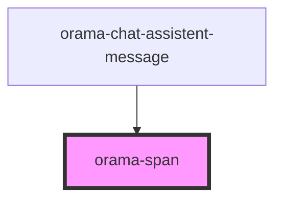

# orama-p

<!-- Auto Generated Below -->

## Properties

| Property | Attribute | Description | Type                                                                              | Default     |
| -------- | --------- | ----------- | --------------------------------------------------------------------------------- | ----------- |
| `as`     | `as`      |             | `"a" \| "h1" \| "h2" \| "h3" \| "h4" \| "h5" \| "h6" \| "p" \| "small" \| "span"` | `undefined` |
| `class`  | `class`   |             | `string`                                                                          | `undefined` |

## Dependencies

### Used by

 - [orama-chat-assistent-message](../orama-chat-messages-container/orama-chat-assistent-message)

### Graph

----------------------------------------------

*Built with [StencilJS](https://stenciljs.com/)*
