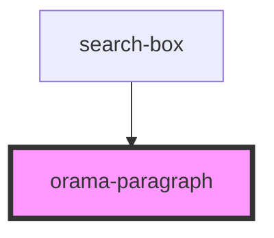

# orama-p

<!-- Auto Generated Below -->

## Properties

| Property | Attribute | Description | Type                                                            | Default     |
| -------- | --------- | ----------- | --------------------------------------------------------------- | ----------- |
| `as`     | `as`      |             | `"h1" \| "h2" \| "h3" \| "h4" \| "h5" \| "h6" \| "p" \| "span"` | `undefined` |

## Dependencies

### Used by

 - [search-box](../../SearchBox)

### Graph

----------------------------------------------

*Built with [StencilJS](https://stenciljs.com/)*
