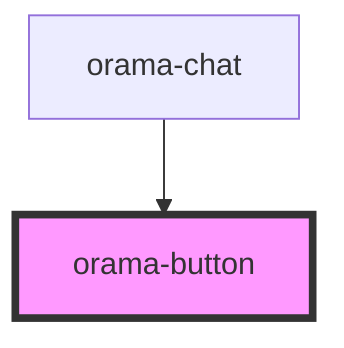

# orama-button

<!-- Auto Generated Below -->

## Properties

| Property  | Attribute | Description | Type                              | Default     |
| --------- | --------- | ----------- | --------------------------------- | ----------- |
| `as`      | `as`      |             | `"a" \| "button"`                 | `'button'`  |
| `class`   | `class`   |             | `string`                          | `undefined` |
| `type`    | `type`    |             | `"button" \| "reset" \| "submit"` | `undefined` |
| `variant` | `variant` |             | `"primary" \| "secondary"`        | `'primary'` |

## Dependencies

### Used by

 - [orama-chat](../orama-chat)

### Graph

----------------------------------------------

*Built with [StencilJS](https://stenciljs.com/)*
