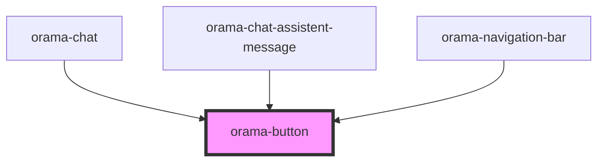

# orama-button

<!-- Auto Generated Below -->

## Properties

| Property      | Attribute      | Description | Type                                 | Default     |
| ------------- | -------------- | ----------- | ------------------------------------ | ----------- |
| `as`          | `as`           |             | `"a" \| "button"`                    | `'button'`  |
| `class`       | `class`        |             | `string`                             | `undefined` |
| `disabled`    | `disabled`     |             | `boolean`                            | `undefined` |
| `type`        | `type`         |             | `"button" \| "reset" \| "submit"`    | `undefined` |
| `variant`     | `variant`      |             | `"icon" \| "primary" \| "secondary"` | `'primary'` |
| `withTooltip` | `with-tooltip` |             | `string`                             | `undefined` |

## Dependencies

### Used by

 - [orama-chat](../orama-chat)
 - [orama-chat-assistent-message](../orama-chat-messages-container/orama-chat-assistent-message)
 - [orama-navigation-bar](../orama-navigation-bar)

### Graph

----------------------------------------------

*Built with [StencilJS](https://stenciljs.com/)*
