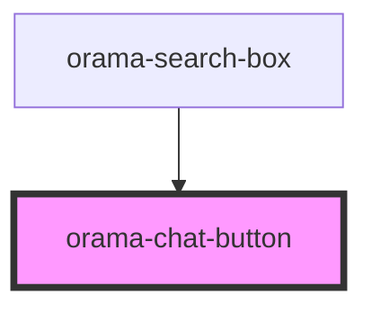

# orama-chat-button

<!-- Auto Generated Below -->

## Properties

| Property    | Attribute   | Description | Type      | Default     |
| ----------- | ----------- | ----------- | --------- | ----------- |
| `active`    | `active`    |             | `boolean` | `false`     |
| `class`     | `class`     |             | `string`  | `undefined` |
| `highlight` | `highlight` |             | `boolean` | `false`     |
| `label`     | `label`     |             | `string`  | `undefined` |

## Dependencies

### Used by

 - [orama-search-box](../../orama-search-box)

### Graph

----------------------------------------------

*Built with [StencilJS](https://stenciljs.com/)*
