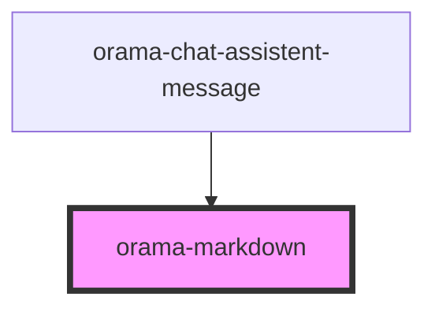

# orama-markdown

<!-- Auto Generated Below -->

## Properties

| Property  | Attribute | Description | Type     | Default     |
| --------- | --------- | ----------- | -------- | ----------- |
| `content` | `content` |             | `string` | `undefined` |

## Dependencies

### Used by

 - [orama-chat-assistent-message](..)

### Graph

----------------------------------------------

*Built with [StencilJS](https://stenciljs.com/)*
