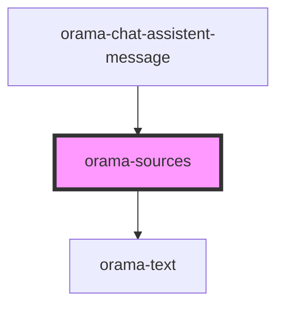

# orama-sources

<!-- Auto Generated Below -->

## Properties

| Property        | Attribute           | Description | Type                                                       | Default                                                                       |
| --------------- | ------------------- | ----------- | ---------------------------------------------------------- | ----------------------------------------------------------------------------- |
| `sourceBaseURL` | `source-base-u-r-l` |             | `string`                                                   | `''`                                                                          |
| `sources`       | `sources`           |             | `any`                                                      | `undefined`                                                                   |
| `sourcesMap`    | --                  |             | `{ title?: string; path?: string; description?: string; }` | `{     title: 'title',     description: 'description',     path: 'path',   }` |

## Dependencies

### Used by

 - [orama-chat-assistent-message](..)

### Depends on

- [orama-text](../../../orama-text)

### Graph

----------------------------------------------

*Built with [StencilJS](https://stenciljs.com/)*
