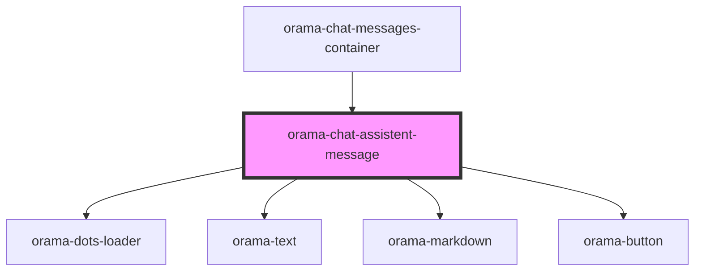

# orama-chat-assistent-message

<!-- Auto Generated Below -->

## Properties

| Property      | Attribute | Description | Type                                                                            | Default     |
| ------------- | --------- | ----------- | ------------------------------------------------------------------------------- | ----------- |
| `interaction` | --        |             | `{ query: string; response?: string; sources?: any[]; status: TAnswerStatus; }` | `undefined` |

## Dependencies

### Used by

 - [orama-chat-messages-container](..)

### Depends on

- [orama-dots-loader](../../orama-dots-loader)
- [orama-text](../../orama-text)
- [orama-markdown](orama-markdown)
- [orama-button](../../orama-button)

### Graph

----------------------------------------------

*Built with [StencilJS](https://stenciljs.com/)*
