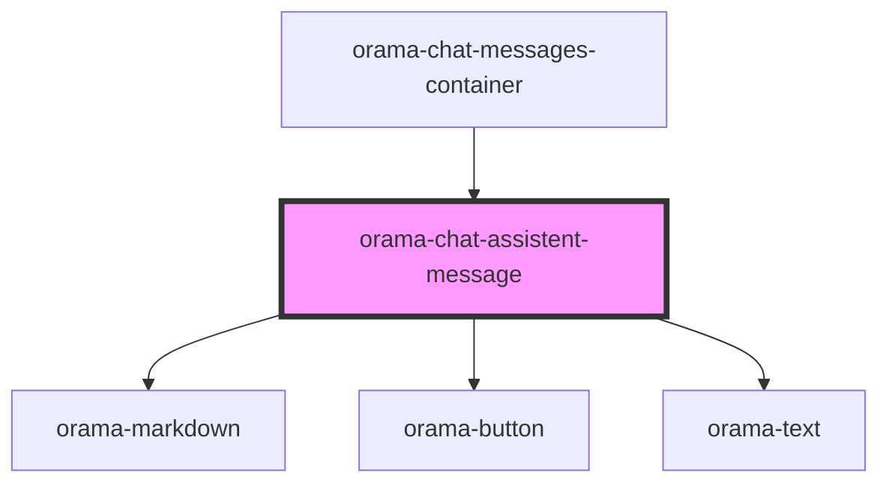

# orama-chat-assistent-message

<!-- Auto Generated Below -->

## Properties

| Property  | Attribute | Description | Type                                                | Default     |
| --------- | --------- | ----------- | --------------------------------------------------- | ----------- |
| `message` | --        |             | `{ role: "user" \| "assistant"; content: string; }` | `undefined` |

## Dependencies

### Used by

 - [orama-chat-messages-container](..)

### Depends on

- [orama-markdown](orama-markdown)
- [orama-button](../../orama-button)
- [orama-text](../../orama-text)

### Graph

----------------------------------------------

*Built with [StencilJS](https://stenciljs.com/)*
