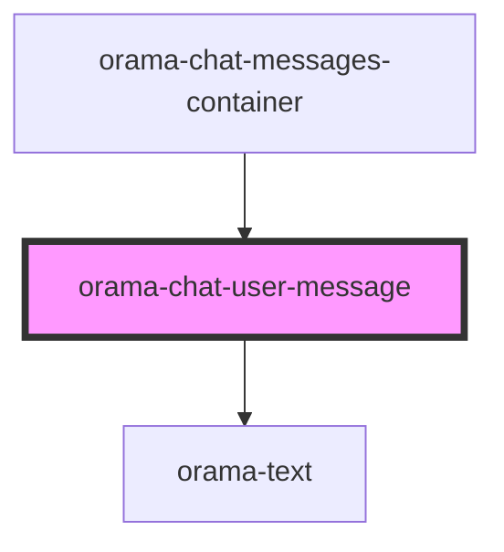

# orama-chat-user-message

<!-- Auto Generated Below -->

## Properties

| Property      | Attribute | Description | Type                                                                                                                          | Default     |
| ------------- | --------- | ----------- | ----------------------------------------------------------------------------------------------------------------------------- | ----------- |
| `interaction` | --        |             | `{ query: string; response?: string; sources?: TSource[]; latest?: boolean; status: TAnswerStatus; interactionId?: string; }` | `undefined` |

## Dependencies

### Used by

 - [orama-chat-messages-container](..)

### Depends on

- [orama-text](../../orama-text)

### Graph

----------------------------------------------

*Built with [StencilJS](https://stenciljs.com/)*
