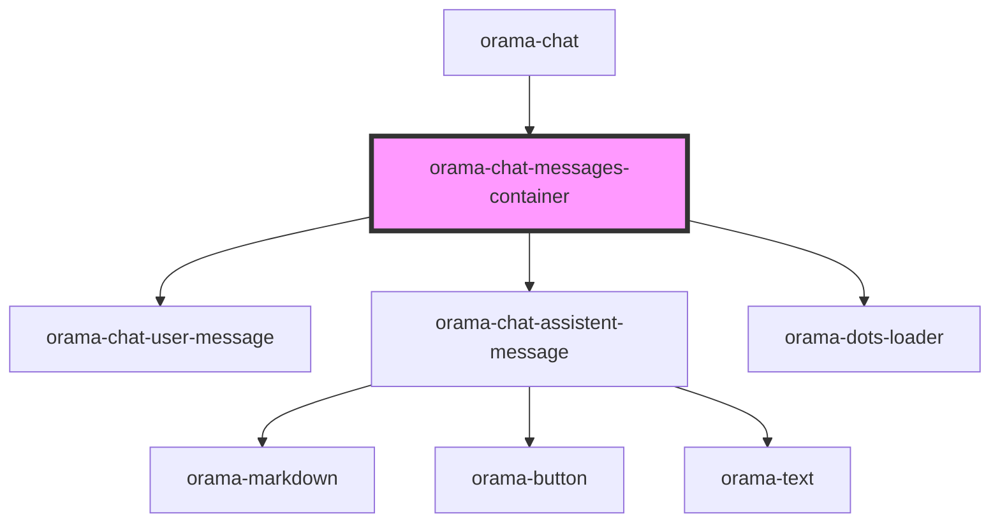

# orama-chat-messages-container

<!-- Auto Generated Below -->

## Dependencies

### Used by

 - [orama-chat](../orama-chat)

### Depends on

- [orama-chat-user-message](orama-chat-user-message)
- [orama-chat-assistent-message](orama-chat-assistent-message)
- [orama-dots-loader](../orama-dots-loader)

### Graph

----------------------------------------------

*Built with [StencilJS](https://stenciljs.com/)*
