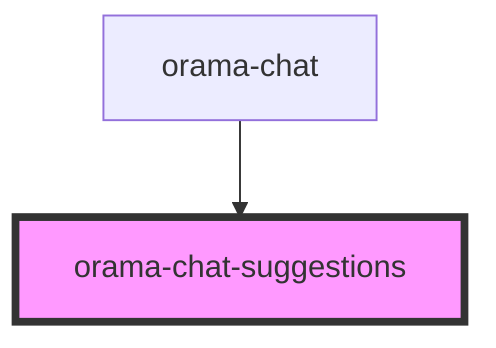

# orama-button

<!-- Auto Generated Below -->

## Properties

| Property            | Attribute | Description | Type                           | Default     |
| ------------------- | --------- | ----------- | ------------------------------ | ----------- |
| `suggestionClicked` | --        |             | `(suggestion: string) => void` | `undefined` |
| `suggestions`       | --        |             | `string[]`                     | `undefined` |

## Dependencies

### Used by

 - [orama-chat](../orama-chat)

### Graph

----------------------------------------------

*Built with [StencilJS](https://stenciljs.com/)*
