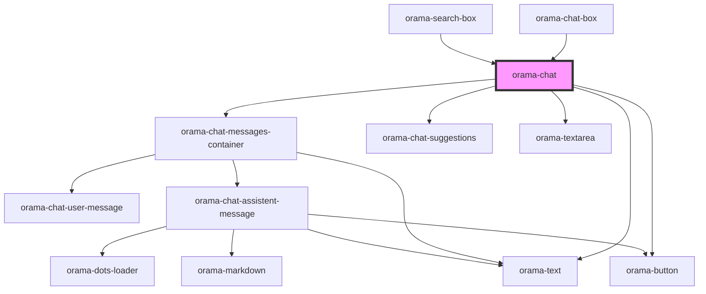

# orama-chat

<!-- Auto Generated Below -->

## Dependencies

### Used by

 - [orama-chat-box](../../orama-chat-box)
 - [orama-search-box](../../orama-search-box)

### Depends on

- [orama-chat-messages-container](../orama-chat-messages-container)
- [orama-chat-suggestions](../orama-chat-suggestions)
- [orama-textarea](../orama-textarea)
- [orama-button](../orama-button)
- [orama-text](../orama-text)

### Graph

----------------------------------------------

*Built with [StencilJS](https://stenciljs.com/)*
