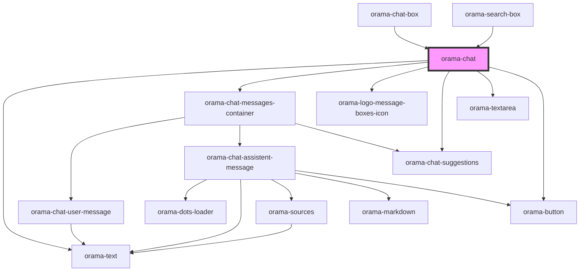

# orama-chat

<!-- Auto Generated Below -->

## Properties

| Property         | Attribute          | Description | Type                                                       | Default             |
| ---------------- | ------------------ | ----------- | ---------------------------------------------------------- | ------------------- |
| `chatTitle`      | `chat-title`       |             | `string`                                                   | `undefined`         |
| `defaultTerm`    | `default-term`     |             | `string`                                                   | `undefined`         |
| `emptyStateText` | `empty-state-text` |             | `string`                                                   | `undefined`         |
| `focusInput`     | `focus-input`      |             | `boolean`                                                  | `false`             |
| `placeholder`    | `placeholder`      |             | `string`                                                   | `'Ask me anything'` |
| `showHeader`     | `show-header`      |             | `boolean`                                                  | `true`              |
| `sourceBaseUrl`  | `source-base-url`  |             | `string`                                                   | `''`                |
| `sourcesMap`     | --                 |             | `{ title?: string; description?: string; path?: string; }` | `undefined`         |
| `suggestions`    | --                 |             | `string[]`                                                 | `undefined`         |

## Dependencies

### Used by

 - [orama-chat-box](../../orama-chat-box)
 - [orama-search-box](../../orama-search-box)

### Depends on

- [orama-text](../orama-text)
- [orama-chat-messages-container](../orama-chat-messages-container)
- [orama-logo-message-boxes-icon](../orama-logo-message-boxes-icon)
- [orama-chat-suggestions](../orama-chat-suggestions)
- [orama-textarea](../orama-textarea)
- [orama-button](../orama-button)

### Graph

----------------------------------------------

*Built with [StencilJS](https://stenciljs.com/)*
