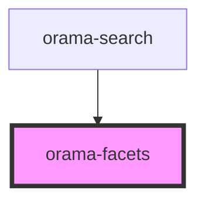

# orama-button

<!-- Auto Generated Below -->

## Properties

| Property       | Attribute       | Description | Type     | Default     |
| -------------- | --------------- | ----------- | -------- | ----------- |
| `currentFacet` | `current-facet` |             | `string` | `undefined` |
| `facets`       | --              |             | `any[]`  | `undefined` |

## Events

| Event           | Description | Type                  |
| --------------- | ----------- | --------------------- |
| `facetSelected` |             | `CustomEvent<string>` |

## Dependencies

### Used by

 - [orama-search](../orama-search)

### Graph

----------------------------------------------

*Built with [StencilJS](https://stenciljs.com/)*
