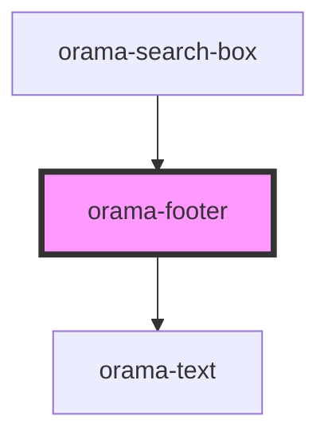

# orama-footer

<!-- Auto Generated Below -->

## Properties

| Property      | Attribute      | Description | Type                            | Default     |
| ------------- | -------------- | ----------- | ------------------------------- | ----------- |
| `class`       | `class`        |             | `string`                        | `undefined` |
| `colorScheme` | `color-scheme` |             | `"dark" \| "light" \| "system"` | `'light'`   |

## Dependencies

### Used by

 - [orama-search-box](../../orama-search-box)

### Depends on

- [orama-text](../orama-text)

### Graph

----------------------------------------------

*Built with [StencilJS](https://stenciljs.com/)*
