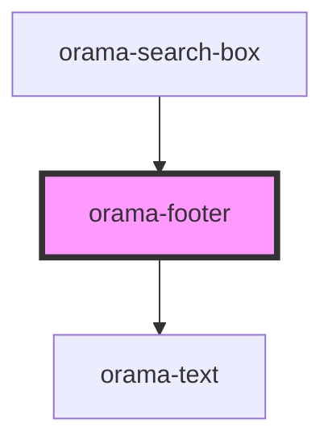

# orama-footer

<!-- Auto Generated Below -->

## Properties

| Property      | Attribute | Description | Type                                                                                                                                                                                                                                                                                                                                                                                                                                                                                                                                                                                                                                                                                                                                                                                                                                                                                                                                                                                                                                                                                                                                                                                                                                                                                                                                                                                                                                                                                                                                                                                                                                                                                                                                                                                                                                                                                                                                                                                                                                                                                                                                                                                                                                                                                                                                                                                                                                                                                                                                                                                                                                                                                                                                                                                                                                                                                                                                                                                                                                                                             | Default     |
| ------------- | --------- | ----------- | -------------------------------------------------------------------------------------------------------------------------------------------------------------------------------------------------------------------------------------------------------------------------------------------------------------------------------------------------------------------------------------------------------------------------------------------------------------------------------------------------------------------------------------------------------------------------------------------------------------------------------------------------------------------------------------------------------------------------------------------------------------------------------------------------------------------------------------------------------------------------------------------------------------------------------------------------------------------------------------------------------------------------------------------------------------------------------------------------------------------------------------------------------------------------------------------------------------------------------------------------------------------------------------------------------------------------------------------------------------------------------------------------------------------------------------------------------------------------------------------------------------------------------------------------------------------------------------------------------------------------------------------------------------------------------------------------------------------------------------------------------------------------------------------------------------------------------------------------------------------------------------------------------------------------------------------------------------------------------------------------------------------------------------------------------------------------------------------------------------------------------------------------------------------------------------------------------------------------------------------------------------------------------------------------------------------------------------------------------------------------------------------------------------------------------------------------------------------------------------------------------------------------------------------------------------------------------------------------------------------------------------------------------------------------------------------------------------------------------------------------------------------------------------------------------------------------------------------------------------------------------------------------------------------------------------------------------------------------------------------------------------------------------------------------------------------------------- | ----------- |
| `class`       | `class`   |             | `string`                                                                                                                                                                                                                                                                                                                                                                                                                                                                                                                                                                                                                                                                                                                                                                                                                                                                                                                                                                                                                                                                                                                                                                                                                                                                                                                                                                                                                                                                                                                                                                                                                                                                                                                                                                                                                                                                                                                                                                                                                                                                                                                                                                                                                                                                                                                                                                                                                                                                                                                                                                                                                                                                                                                                                                                                                                                                                                                                                                                                                                                                         | `undefined` |
| `colorScheme` | --        |             | `{ readonly [x: number]: string; [Symbol.iterator]: () => IterableIterator<string>; toString: () => string; charAt: (pos: number) => string; charCodeAt: (index: number) => number; concat: (...strings: string[]) => string; indexOf: (searchString: string, position?: number) => number; lastIndexOf: (searchString: string, position?: number) => number; localeCompare: { (that: string): number; (that: string, locales?: string \| string[], options?: CollatorOptions): number; (that: string, locales?: LocalesArgument, options?: CollatorOptions): number; }; match: { (regexp: string \| RegExp): RegExpMatchArray; (matcher: { [Symbol.match](string: string): RegExpMatchArray; }): RegExpMatchArray; }; replace: { (searchValue: string \| RegExp, replaceValue: string): string; (searchValue: string \| RegExp, replacer: (substring: string, ...args: any[]) => string): string; (searchValue: { [Symbol.replace](string: string, replaceValue: string): string; }, replaceValue: string): string; (searchValue: { [Symbol.replace](string: string, replacer: (substring: string, ...args: any[]) => string): string; }, replacer: (substring: string, ...args: any[]) => string): string; }; search: { (regexp: string \| RegExp): number; (searcher: { [Symbol.search](string: string): number; }): number; }; slice: (start?: number, end?: number) => string; split: { (separator: string \| RegExp, limit?: number): string[]; (splitter: { [Symbol.split](string: string, limit?: number): string[]; }, limit?: number): string[]; }; substring: (start: number, end?: number) => string; toLowerCase: () => string; toLocaleLowerCase: { (locales?: string \| string[]): string; (locales?: LocalesArgument): string; }; toUpperCase: () => string; toLocaleUpperCase: { (locales?: string \| string[]): string; (locales?: LocalesArgument): string; }; trim: () => string; readonly length: number; substr: (from: number, length?: number) => string; valueOf: () => string; codePointAt: (pos: number) => number; includes: (searchString: string, position?: number) => boolean; endsWith: (searchString: string, endPosition?: number) => boolean; normalize: { (form: "NFC" \| "NFD" \| "NFKC" \| "NFKD"): string; (form?: string): string; }; repeat: (count: number) => string; startsWith: (searchString: string, position?: number) => boolean; anchor: (name: string) => string; big: () => string; blink: () => string; bold: () => string; fixed: () => string; fontcolor: (color: string) => string; fontsize: { (size: number): string; (size: string): string; }; italics: () => string; link: (url: string) => string; small: () => string; strike: () => string; sub: () => string; sup: () => string; padStart: (maxLength: number, fillString?: string) => string; padEnd: (maxLength: number, fillString?: string) => string; trimEnd: () => string; trimStart: () => string; trimLeft: () => string; trimRight: () => string; matchAll: (regexp: RegExp) => IterableIterator<RegExpExecArray>; at: (index: number) => string; }` | `'light'`   |

## Dependencies

### Used by

 - [orama-search-box](../../orama-search-box)

### Depends on

- [orama-text](../orama-text)

### Graph

----------------------------------------------

*Built with [StencilJS](https://stenciljs.com/)*
