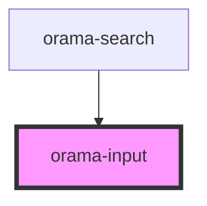

# orama-input

<!-- Auto Generated Below -->

## Properties

| Property                | Attribute                  | Description | Type                                                                        | Default     |
| ----------------------- | -------------------------- | ----------- | --------------------------------------------------------------------------- | ----------- |
| `autoFocus`             | `auto-focus`               |             | `boolean`                                                                   | `false`     |
| `defaultValue`          | `default-value`            |             | `string`                                                                    | `undefined` |
| `label`                 | `label`                    |             | `string`                                                                    | `undefined` |
| `labelForScreenReaders` | `label-for-screen-readers` |             | `string`                                                                    | `undefined` |
| `name`                  | `name`                     |             | `string`                                                                    | `undefined` |
| `placeholder`           | `placeholder`              |             | `string`                                                                    | `undefined` |
| `size`                  | `size`                     |             | `"large" \| "medium" \| "small"`                                            | `'medium'`  |
| `type`                  | `type`                     |             | `"email" \| "number" \| "password" \| "search" \| "tel" \| "text" \| "url"` | `'text'`    |

## Events

| Event        | Description | Type                |
| ------------ | ----------- | ------------------- |
| `resetValue` |             | `CustomEvent<void>` |

## Dependencies

### Used by

 - [orama-search](../orama-search)

### Graph

----------------------------------------------

*Built with [StencilJS](https://stenciljs.com/)*
