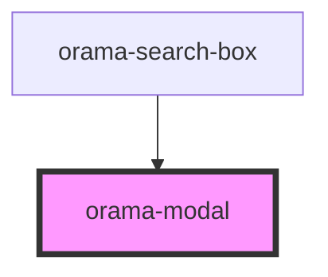

# orama-modal

<!-- Auto Generated Below -->

## Properties

| Property    | Attribute    | Description | Type      | Default |
| ----------- | ------------ | ----------- | --------- | ------- |
| `isOpen`    | `is-open`    |             | `boolean` | `false` |
| `mainTitle` | `main-title` |             | `string`  | `''`    |

## Dependencies

### Used by

 - [orama-search-box](../../orama-search-box)

### Graph

----------------------------------------------

*Built with [StencilJS](https://stenciljs.com/)*
