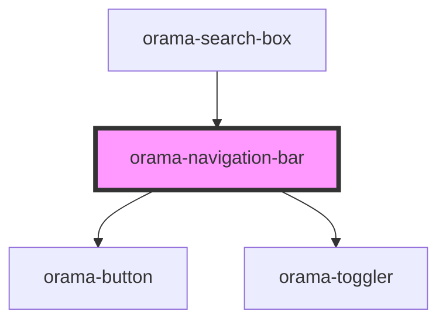

# orama-navigation-bar

<!-- Auto Generated Below -->

## Properties

| Property          | Attribute           | Description | Type         | Default     |
| ----------------- | ------------------- | ----------- | ------------ | ----------- |
| `handleClose`     | --                  |             | `() => void` | `undefined` |
| `showChatActions` | `show-chat-actions` |             | `boolean`    | `false`     |

## Dependencies

### Used by

 - [orama-search-box](../../orama-search-box)

### Depends on

- [orama-button](../orama-button)
- [orama-toggler](../orama-toggler)

### Graph

----------------------------------------------

*Built with [StencilJS](https://stenciljs.com/)*
