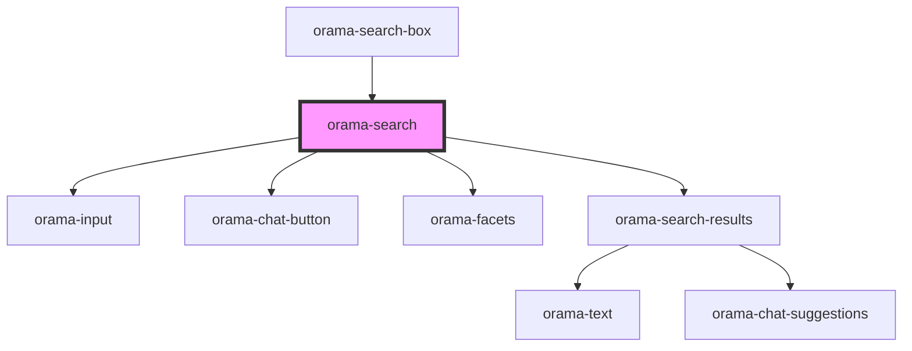

# orama-search

<!-- Auto Generated Below -->

## Properties

| Property        | Attribute         | Description | Type       | Default     |
| --------------- | ----------------- | ----------- | ---------- | ----------- |
| `disableChat`   | `disable-chat`    |             | `boolean`  | `false`     |
| `focusInput`    | `focus-input`     |             | `boolean`  | `false`     |
| `sourceBaseUrl` | `source-base-url` |             | `string`   | `undefined` |
| `suggestions`   | --                |             | `string[]` | `[]`        |

## Dependencies

### Used by

 - [orama-search-box](../../orama-search-box)

### Depends on

- [orama-input](../orama-input)
- [orama-chat-button](../orama-chat-button)
- [orama-facets](../orama-facets)
- [orama-search-results](../orama-search-results)

### Graph

----------------------------------------------

*Built with [StencilJS](https://stenciljs.com/)*
