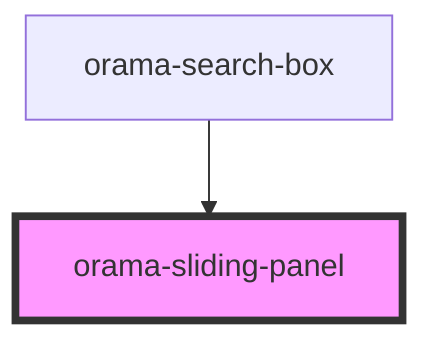

# orama-slideing-panel

<!-- Auto Generated Below -->

## Properties

| Property | Attribute | Description | Type         | Default     |
| -------- | --------- | ----------- | ------------ | ----------- |
| `closed` | --        |             | `() => void` | `undefined` |
| `open`   | `open`    |             | `boolean`    | `false`     |

## Dependencies

### Used by

 - [orama-search-box](../../orama-search-box)

### Graph

----------------------------------------------

*Built with [StencilJS](https://stenciljs.com/)*
