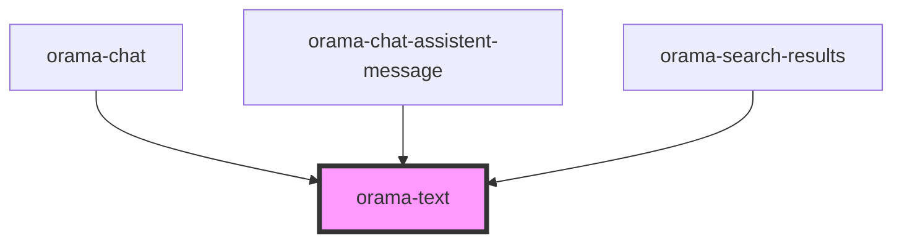

# orama-p

<!-- Auto Generated Below -->

## Properties

| Property   | Attribute   | Description                        | Type                                                                              | Default     |
| ---------- | ----------- | ---------------------------------- | --------------------------------------------------------------------------------- | ----------- |
| `as`       | `as`        | it defines the HTML tag to be used | `"a" \| "h1" \| "h2" \| "h3" \| "h4" \| "h5" \| "h6" \| "p" \| "small" \| "span"` | `'p'`       |
| `class`    | `class`     | the optional class name            | `string`                                                                          | `undefined` |
| `styledAs` | `styled-as` | it defines how it should look like | `"p" \| "small" \| "span"`                                                        | `undefined` |

## Dependencies

### Used by

 - [orama-chat](../orama-chat)
 - [orama-chat-assistent-message](../orama-chat-messages-container/orama-chat-assistent-message)
 - [orama-search-results](../orama-search-results)

### Graph

----------------------------------------------

*Built with [StencilJS](https://stenciljs.com/)*
