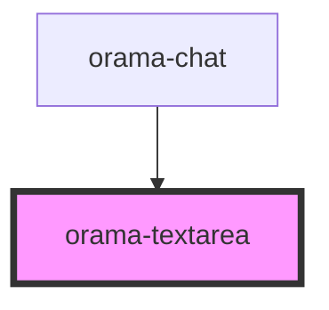

# orama-textarea

<!-- Auto Generated Below -->

## Properties

| Property      | Attribute     | Description | Type               | Default     |
| ------------- | ------------- | ----------- | ------------------ | ----------- |
| `autoFocus`   | `auto-focus`  |             | `boolean`          | `false`     |
| `maxRows`     | `max-rows`    |             | `number \| string` | `undefined` |
| `minRows`     | `min-rows`    |             | `number \| string` | `1`         |
| `placeholder` | `placeholder` |             | `string`           | `undefined` |
| `value`       | `value`       |             | `string`           | `''`        |

## Dependencies

### Used by

 - [orama-chat](../orama-chat)

### Graph

----------------------------------------------

*Built with [StencilJS](https://stenciljs.com/)*
