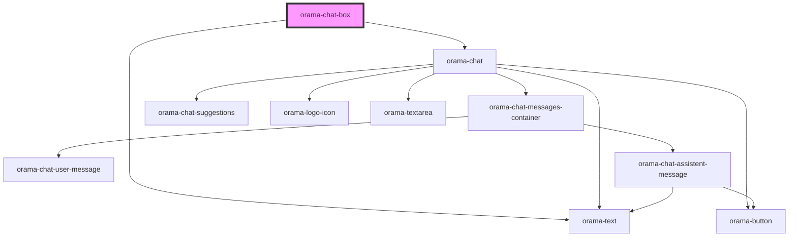

# orama-chat-box

<!-- Auto Generated Below -->

## Properties

| Property     | Attribute | Description | Type                                     | Default     |
| ------------ | --------- | ----------- | ---------------------------------------- | ----------- |
| `cloudIndex` | --        |             | `{ api_key: string; endpoint: string; }` | `undefined` |

## Dependencies

### Depends on

- [orama-text](../internal/orama-text)
- [orama-chat](../internal/orama-chat)

### Graph

----------------------------------------------

*Built with [StencilJS](https://stenciljs.com/)*
