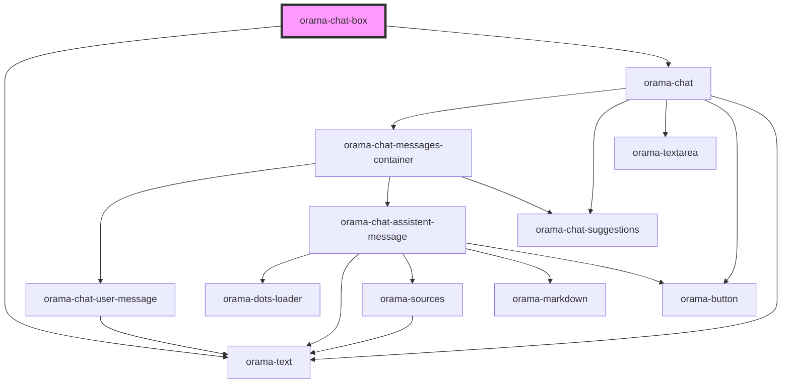

# orama-chat-box

<!-- Auto Generated Below -->

## Properties

| Property         | Attribute         | Description | Type                                                       | Default     |
| ---------------- | ----------------- | ----------- | ---------------------------------------------------------- | ----------- |
| `autoFocus`      | `auto-focus`      |             | `boolean`                                                  | `true`      |
| `clientInstance` | --                |             | `OramaClient`                                              | `undefined` |
| `index`          | --                |             | `{ api_key: string; endpoint: string; }`                   | `undefined` |
| `linksRel`       | `links-rel`       |             | `string`                                                   | `undefined` |
| `linksTarget`    | `links-target`    |             | `string`                                                   | `undefined` |
| `placeholder`    | `placeholder`     |             | `string`                                                   | `undefined` |
| `sourceBaseUrl`  | `source-base-url` |             | `string`                                                   | `undefined` |
| `sourcesMap`     | --                |             | `{ title?: string; description?: string; path?: string; }` | `undefined` |
| `suggestions`    | --                |             | `string[]`                                                 | `undefined` |

## Dependencies

### Depends on

- [orama-text](../internal/orama-text)
- [orama-chat](../internal/orama-chat)

### Graph

----------------------------------------------

*Built with [StencilJS](https://stenciljs.com/)*
