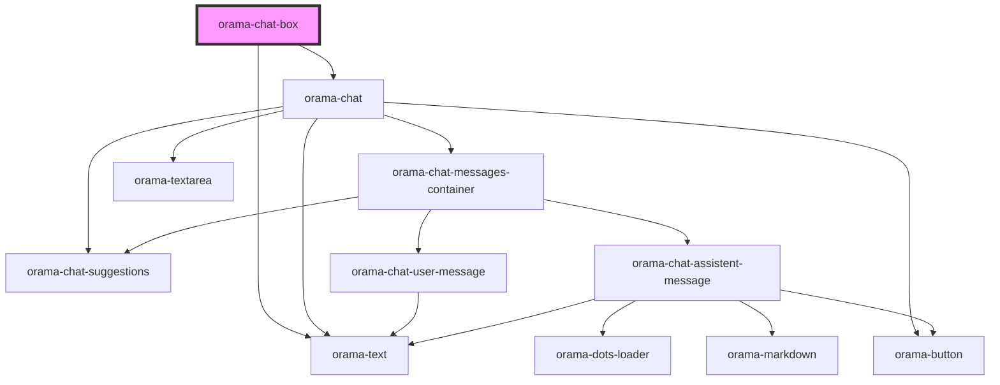

# orama-chat-box

<!-- Auto Generated Below -->

## Properties

| Property        | Attribute           | Description | Type                                     | Default     |
| --------------- | ------------------- | ----------- | ---------------------------------------- | ----------- |
| `index`         | --                  |             | `{ api_key: string; endpoint: string; }` | `undefined` |
| `placeholder`   | `placeholder`       |             | `any`                                    | `undefined` |
| `sourceBaseURL` | `source-base-u-r-l` |             | `any`                                    | `undefined` |

## Dependencies

### Depends on

- [orama-text](../internal/orama-text)
- [orama-chat](../internal/orama-chat)

### Graph

----------------------------------------------

*Built with [StencilJS](https://stenciljs.com/)*
