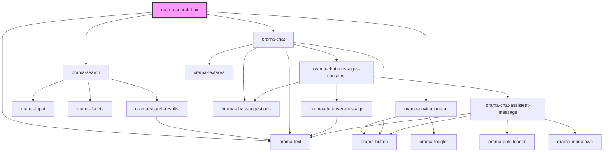

# search-box

<!-- Auto Generated Below -->

## Properties

| Property        | Attribute        | Description | Type                                                                                                                                                                                                                                                                                                                                                                                                                                                                                                                                                                                                                                                                                                                                                                                                                                                                                                                                                                                                                                                                                                                                                                                                                                                                           | Default     |
| --------------- | ---------------- | ----------- | ------------------------------------------------------------------------------------------------------------------------------------------------------------------------------------------------------------------------------------------------------------------------------------------------------------------------------------------------------------------------------------------------------------------------------------------------------------------------------------------------------------------------------------------------------------------------------------------------------------------------------------------------------------------------------------------------------------------------------------------------------------------------------------------------------------------------------------------------------------------------------------------------------------------------------------------------------------------------------------------------------------------------------------------------------------------------------------------------------------------------------------------------------------------------------------------------------------------------------------------------------------------------------ | ----------- |
| `cloudIndex`    | --               |             | `{ api_key: string; endpoint: string; }`                                                                                                                                                                                                                                                                                                                                                                                                                                                                                                                                                                                                                                                                                                                                                                                                                                                                                                                                                                                                                                                                                                                                                                                                                                       | `undefined` |
| `colorScheme`   | `color-scheme`   |             | `"dark" \| "light" \| "system"`                                                                                                                                                                                                                                                                                                                                                                                                                                                                                                                                                                                                                                                                                                                                                                                                                                                                                                                                                                                                                                                                                                                                                                                                                                                | `'light'`   |
| `facetProperty` | `facet-property` |             | `string`                                                                                                                                                                                                                                                                                                                                                                                                                                                                                                                                                                                                                                                                                                                                                                                                                                                                                                                                                                                                                                                                                                                                                                                                                                                                       | `undefined` |
| `open`          | `open`           |             | `boolean`                                                                                                                                                                                                                                                                                                                                                                                                                                                                                                                                                                                                                                                                                                                                                                                                                                                                                                                                                                                                                                                                                                                                                                                                                                                                      | `false`     |
| `resultMap`     | --               |             | `{ title?: string; description?: string; path?: string; section?: string; }`                                                                                                                                                                                                                                                                                                                                                                                                                                                                                                                                                                                                                                                                                                                                                                                                                                                                                                                                                                                                                                                                                                                                                                                                   | `{}`        |
| `themeConfig`   | --               |             | `{ typography?: DeepPartial<{ '--font-primary': string; }>; colors?: DeepPartial<{ light: { '--text-color-primary': string; '--text-color-secondary': string; '--text-color-teriary': string; '--text-color-inactive': string; '--background-color-primary': string; '--background-color-secondary': string; '--background-color-tertiary': string; '--background-color-fourth': string; '--border-color-primary': string; '--border-color-secondary': string; '--border-color-inactive': string; '--icon-color-primary': string; '--icon-color-secondary': string; '--icon-color-tertiary': string; '--icon-color-inactive': string; '--icon-color-accent': string; }; dark: { '--text-color-primary': string; '--text-color-secondary': string; '--text-color-teriary': string; '--text-color-inactive': string; '--background-color-primary': string; '--background-color-secondary': string; '--background-color-tertiary': string; '--background-color-fourth': string; '--border-color-primary': string; '--border-color-secondary': string; '--border-color-inactive': string; '--icon-color-primary': string; '--icon-color-secondary': string; '--icon-color-tertiary': string; '--icon-color-inactive': string; '--icon-color-accent': string; }; system: {}; }>; }` | `undefined` |

## Dependencies

### Depends on

- [orama-text](../internal/orama-text)
- [orama-navigation-bar](../internal/orama-navigation-bar)
- [orama-search](../internal/orama-search)
- [orama-chat](../internal/orama-chat)

### Graph

----------------------------------------------

*Built with [StencilJS](https://stenciljs.com/)*
